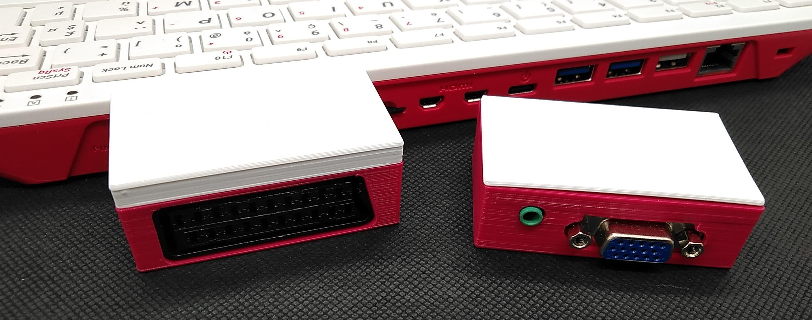
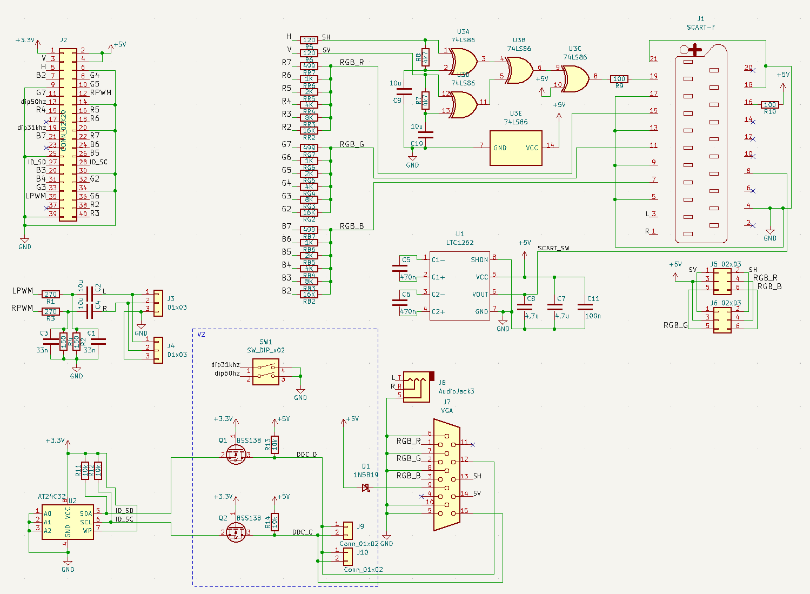
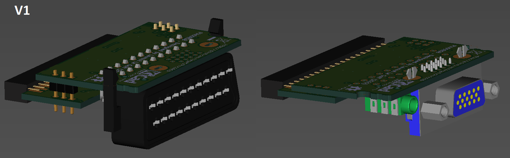

[:fr:](LISEZMOI.md) [:uk:](README.md)

# Pi400RGB
Interface Péritel/VGA pour le Raspberry Pi 400

Evolution du VGA_Zero (https://github.com/llegoff/VGA_Zero) et du Pi400VGA (https://github.com/llegoff/Pi400VGA)

Achetez sur [ebay](https://www.ebay.fr/itm/403514313069) :package:

### DPI (Display parallel Interface)
Comme pour l'interface [VGA666](https://github.com/fenlogic/vga666), ce montage utilise le l'interface DPI du Raspberry pi (mode 6), 

voir https://www.raspberrypi.org/documentation/hardware/raspberrypi/dpi/README.md

seuls les bits nécessaires du dpi sont redirigées sur le port GPIO 40 broches, avec la ligne 'gpio=2-9,12-17,20-25=a2' dufichier config.txt 

/boot/config.txt

    # disable i2c, pin use by h-sync & v-sync
    dtparam=i2c_arm=off
    # remplacer dtoverlay=vc4-kms-v3d par
    dtoverlay=vc4-fkms-v3d
    #configuration DPI
    gpio=2-9,12-17,20-24=a2
    dpi_output_format=0x6
    enable_dpi_lcd=1
    display_default_lcd=1
    dpi_group=2
    dpi_mode=16
    #---------------- dpi_mode line VGA ---------------------
    #---> 640x480 60hz    dpi_mode=4
    #---> 800x600 60hz    dpi_mode=9
    #---> 1024x768 60hz   dpi_mode=16
    #---> 1280x768 60hz   dpi_mode=23
    #---> 1280x800 60hz   dpi_mode=28
    #---> 1280x960 60hz   dpi_mode=32
    #---> 1280x1024 60hz  dpi_mode=35
    #---> 1360x768 60hz   dpi_mode=39
    #---> 1366x768 60hz   dpi_mode=81
    #---> 1400x1050 60hz  dpi_mode=42
    #---> 1440x900 60hz   dpi_mode=47
    #---> 1600x1200 60hz  dpi_mode=51
    #---> 1680x1050 60hz  dpi_mode=58
    #---> 1920x1080 60hz  dpi_mode=82
    #---> 1920x1200 60hz  dpi_mode=69
    #---> 1920x1440 60hz  dpi_mode=73    
    #--------------- dpi_mode line SCART ------------------
    dpi_mode=87
    hdmi_timings=506 1 8 44 52 240 1 6 10 6 0 0 0 60 0 9600000 1
    #hdmi_timings=320 1 17 33 34 224 1 14 8 18 0 0 0 60 0 6400000 1

### Interface audio
le son est généré en MLI (PWM) à partir des broches gpio 18 & 19

/boot/config.txt

    # Enable audio on GPIO for Pi 400
    dtoverlay=audremap,pins_18_19
    dtparam=audio=on
  
### Recalbox

Editez le fichier de configuration /crt/recalbox-crt-options.cfg qui se trouve dans la partition [RECALBOX] lorsque vous placez la carte sd dans votre ordinateur:

    # Pour rgbpi
    adapter.type = rgbpi

https://wiki.recalbox.com/fr/tutorials/video/crt/recalbox-on-crt-with-scart-dac

![img/recalbox-config.png]
   
## Schéma & Circuit Imprimé

## Installation
Copier le contenu du fichier [config-example.txt](img/config-example.txt?raw=true) dans le fichier /boot/config.txt

## Révision
rev1

rev2 : ajout du DDC sur le connecteur VGA et dip switch, arrive prochainement
