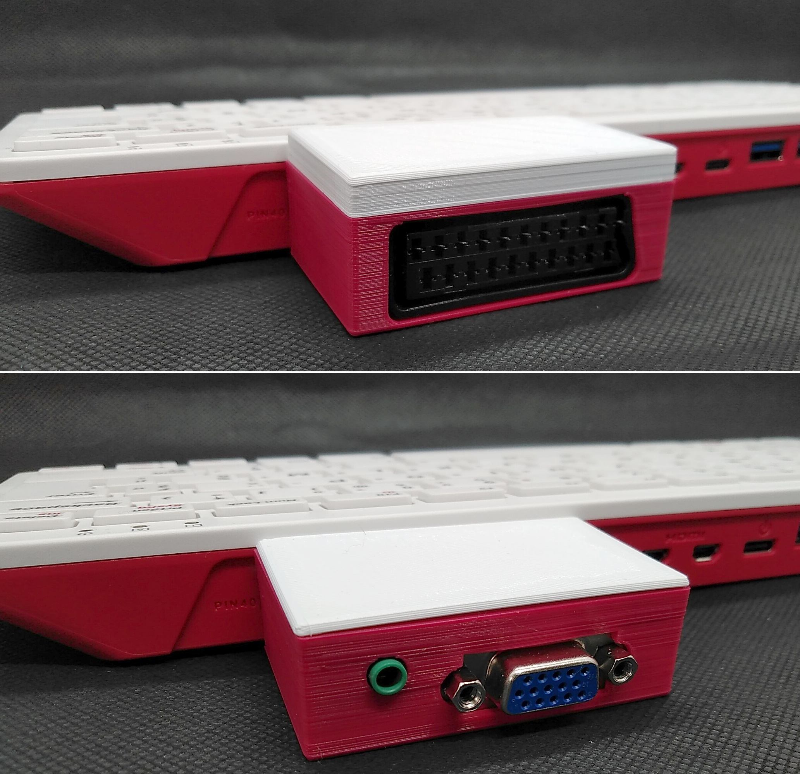
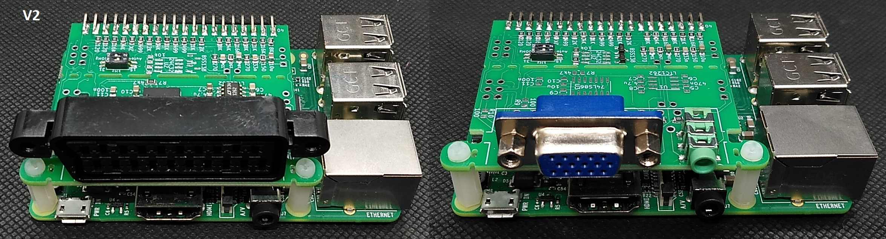
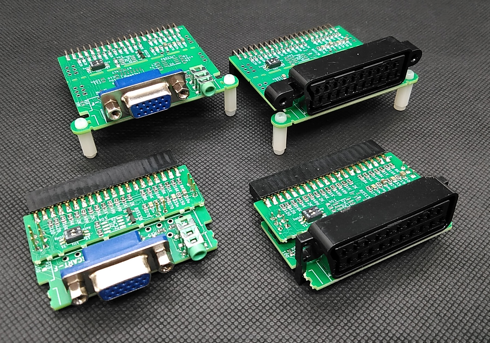
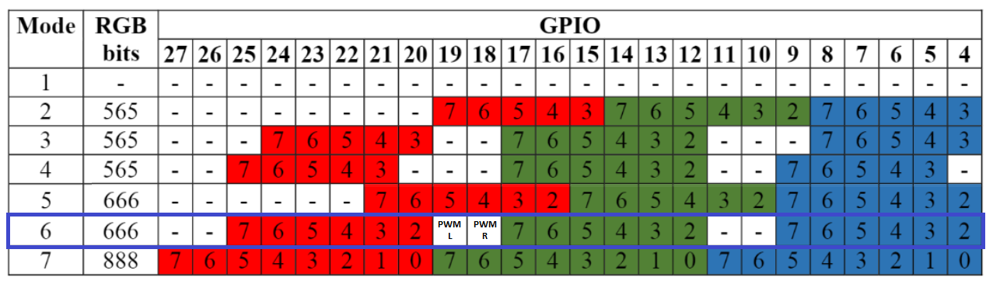
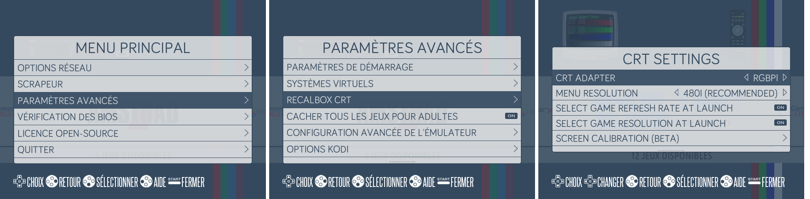
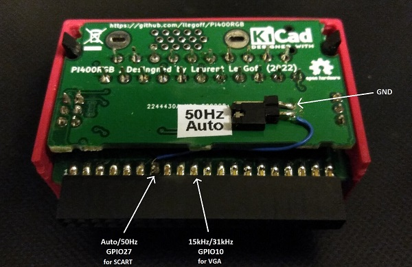
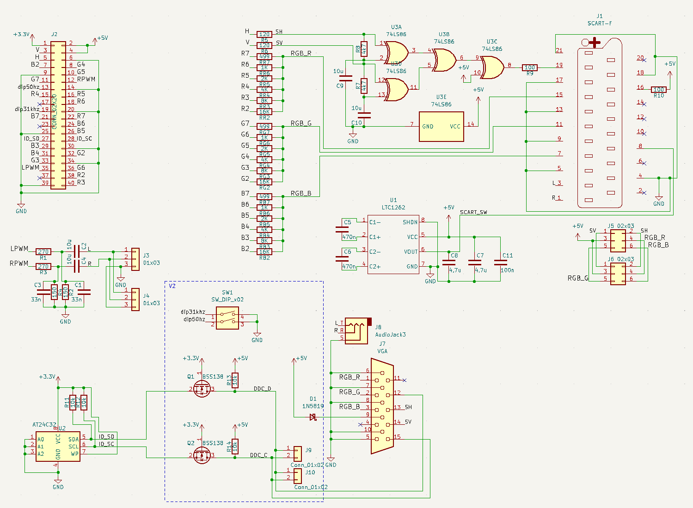
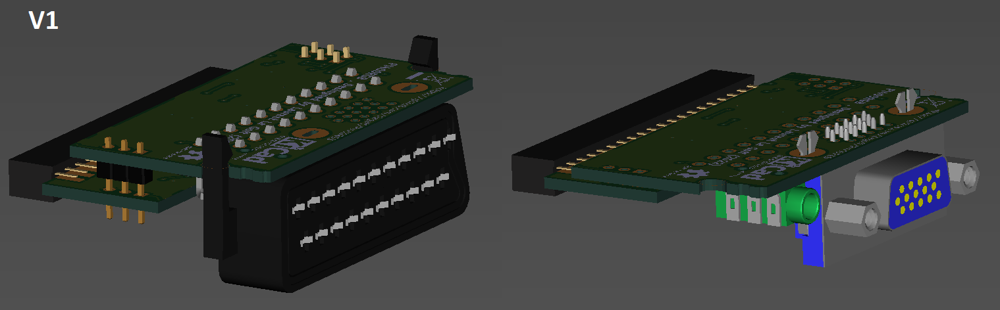
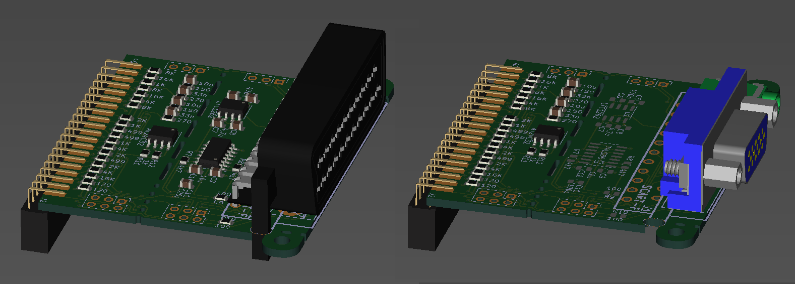

[:fr:](LISEZMOI.md) [:uk:](README.md)

# Pi400RGB
Scart/VGA interface for Raspberry Pi 400

Evolution of VGA_Zero (https://github.com/llegoff/VGA_Zero) and Pi400VGA (https://github.com/llegoff/Pi400VGA)

buy V1 SCART on [ebay  :package: :credit_card:](https://www.ebay.fr/itm/403514313069) , with recalbox auto/50hz config jumper

buy V1 VGA on [ebay  :package: :credit_card:](https://www.ebay.fr/itm/403577489257)

buy V2 on [ebay  :package: :credit_card:](https://www.ebay.fr/itm/403578324991)

### DPI (Display parallel Interface)
Like [VGA666](https://github.com/fenlogic/vga666), this pcb uses dpi interface (in mode 6 to free gpio 18 & 19)

see https://www.raspberrypi.org/documentation/hardware/raspberrypi/dpi/README.md

only the necessary bits of the dpi are redirected to the 40-pin GPIO port, with the 'gpio=2-9,12-17,20-25=a2' line on config.txt

/boot/config.txt

    # disable i2c, pin use by h-sync & v-sync
    dtparam=i2c_arm=off
    # remplace dtoverlay=vc4-kms-v3d by
    dtoverlay=vc4-fkms-v3d
    #configuration DPI
    gpio=2-9,12-17,20-24=a2
    dpi_output_format=0x6
    enable_dpi_lcd=1
    display_default_lcd=1
    dpi_group=2
    dpi_mode=16
    #---------------- dpi_mode line VGA ---------------------
    #---> 640x480 60hz    dpi_mode=4
    #---> 800x600 60hz    dpi_mode=9
    #---> 1024x768 60hz   dpi_mode=16
    #---> 1280x768 60hz   dpi_mode=23
    #---> 1280x800 60hz   dpi_mode=28
    #---> 1280x960 60hz   dpi_mode=32
    #---> 1280x1024 60hz  dpi_mode=35
    #---> 1360x768 60hz   dpi_mode=39
    #---> 1366x768 60hz   dpi_mode=81
    #---> 1400x1050 60hz  dpi_mode=42
    #---> 1440x900 60hz   dpi_mode=47
    #---> 1600x1200 60hz  dpi_mode=51
    #---> 1680x1050 60hz  dpi_mode=58
    #---> 1920x1080 60hz  dpi_mode=82
    #---> 1920x1200 60hz  dpi_mode=69
    #---> 1920x1440 60hz  dpi_mode=73    
    #--------------- dpi_mode line SCART ------------------
    dpi_mode=87
    #244p@60
    #hdmi_timings=320 1 4 30 46 240 1 4 5 14 0 0 0 60 0 6400000 1
    #288p@50
    #hdmi_timings=384 1 16 32 40 288 1 3 2 19 0 0 0 50 0 7363200 1
    #576i@50
    hdmi_timings=768 1 24 72 88 576 1 6 5 38 0 0 0 50 1 14875000 1
    #480i@60
    #hdmi_timings=640 1 24 64 104 480 1 3 6 34 0 0 0 60 1 13054080 1
    #480p@60
    #hdmi_timings=640 1 24 96 48 480 1 11 2 32 0 0 0 60 0 25452000 1

Configuration working with vc4-kms-v3d

    dtoverlay=vc4-kms-dpi-generic,rgb666-padhi
    dtparam=hactive=768,hfp=24,hsync=72,hbp=88
    dtparam=vactive=576,vfp=6,vsync=5,vbp=38
    dtparam=clock-frequency=14875000
    #   Resolution@freq  hactive hfp hsync  hbp vactive vfp vsync vbp  clock-frequency
    #VGA   640x480  @60   640     16   96    48   480    10   2    33    25175000
    #SVGA  800x600  @60   800     40  128    88   600     1   4    23    40000000
    #XGA  1024x768  @60  1024     24  136   160   768     3   6    29    65000000
    #VESA 1368x768  @60  1368     72  144   216   768     1   3    23    85860000
    #VESA 1280x800  @60  1280     64  136   200   800     1   3    24    83460000
    #VESA 1280x1024 @60  1280     48  112   248  1024     1   3    38   108000000
    #VESA 1400x1050 @60  1400     88  152   240  1050     1   3    33   122660000
    #VESA 1600x1200 @60  1600     64  192   304  1200     1   3    46   162000000
    #--- TV -----
    #244p (NTSC res)@60   320      4   30    46   240     4   5    14     6400000
    #288p (PAL res) @50   384     16   32    40   288     3   2    19     7363200
    #480i (NTSC res)@60   640     24   64   104   480     3   6    34    13054080
    #576i (PAL res) @50   768     24   72    88   576     6   5    38    14875000
    #480p           @60   640     24   96    48   480    11   2    32    25452000
    #720p           @60  1280    110   40   220   720     5   5    20    74250000
    #1080p          @60  1920     88   44   148  1080     4   5    36   148500000
    #more timming on http://tinyvga.com/vga-timing

### Audio Interface
audio interface is connected to gpio 18 & 19 (PWM)

/boot/config.txt

    # Enable audio for PiZero(loads snd_bcm2835)
    dtoverlay=audremap,pins_18_19
    dtparam=audio=on

### Recalbox

edit the config file /crt/recalbox-crt-options.cfg in the [RECALBOX] partition mounted when you plug the SD card in your computer:

Until the official release of Recalbox 8.1, you will have to use the special version stamped

see manual : https://www.recalbox.com/recalbox-rgb-dual/manual/

edit the config file /crt/recalbox-crt-options.cfg

    # Pour recalboxrgbdual
    adapter.type = recalboxrgbdual

https://wiki.recalbox.com/en/tutorials/video/crt/recalbox-on-crt-with-scart-dac

Add a jumper on V1 PCB

## Schematic

## PCB

## Installation
copy content of [config-example.txt](img/config-example.txt?raw=true) to /boot/config.txt

## Révision
rev1 : initial version

rev2 : add DDC on VGA connector and dip switch for recalbox configuration, coming soon
